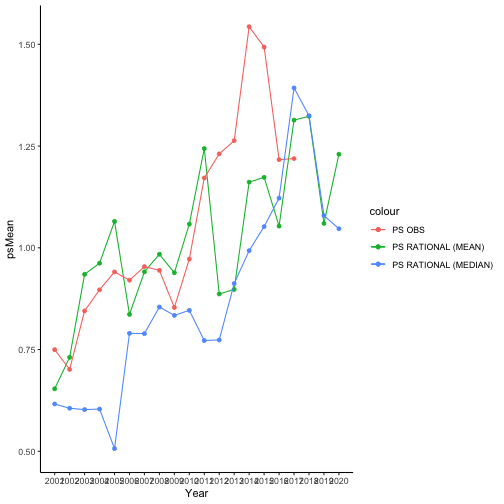

# Equilibrium prices and quaantities


### Fed cattle prices and quantities

#### Prices

```r
kable(EQestObsPS, align = 'c')
```


| Year | psMean | psMedian |   ps   | errMean | errmedian |
|:----:|:------:|:--------:|:------:|:-------:|:---------:|
| 2001 | 0.5940 |  0.6539  | 0.7497 | 0.1556  |  0.0957   |
| 2002 | 0.6207 |  0.6917  | 0.7012 | 0.0806  |  0.0095   |
| 2003 | 0.6720 |  0.7546  | 0.8450 | 0.1730  |  0.0904   |
| 2004 | 0.6761 |  0.7551  | 0.8968 | 0.2207  |  0.1418   |
| 2005 | 0.6587 |  0.7235  | 0.9408 | 0.2822  |  0.2173   |
| 2006 | 0.8561 |  0.8845  | 0.9204 | 0.0643  |  0.0359   |
| 2007 | 0.9481 |  0.8970  | 0.9538 | 0.0057  |  0.0569   |
| 2008 | 1.0215 |  0.9706  | 0.9447 | -0.0769 |  -0.0259  |
| 2009 | 0.9735 |  0.9488  | 0.8533 | -0.1202 |  -0.0954  |
| 2010 | 1.0170 |  0.9923  | 0.9723 | -0.0447 |  -0.0200  |
| 2011 | 1.0323 |  0.9793  | 1.1717 | 0.1394  |  0.1923   |
| 2012 | 0.8841 |  0.8799  | 1.2308 | 0.3467  |  0.3510   |
| 2013 | 1.0212 |  1.0061  | 1.2633 | 0.2421  |  0.2573   |
| 2014 | 1.1449 |  1.1840  | 1.5433 | 0.3984  |  0.3593   |
| 2015 | 1.1957 |  1.2430  | 1.4933 | 0.2976  |  0.2503   |
| 2016 | 1.2307 |  1.2773  | 1.2167 | -0.0141 |  -0.0606  |
| 2017 | 1.5345 |  1.5978  | 1.2192 | -0.3153 |  -0.3787  |
| 2018 | 1.4725 |  1.5361  |   NA   |   NA    |    NA     |
| 2019 | 1.1928 |  1.2300  |   NA   |   NA    |    NA     |
| 2020 | 1.2060 |  1.2468  |   NA   |   NA    |    NA     |


```r
EQestObsPS_plot
```


#### Quantities

```r
kable(EQestObsSL, align = 'c')
```


| Year | slMean  | slMedian |  slSM   | errMean | errmedian |
|:----:|:-------:|:--------:|:-------:|:-------:|:---------:|
| 2001 | 22.9786 | 22.9288  | 23.6238 | 0.6452  |  0.6950   |
| 2002 | 22.7529 | 22.6749  | 23.8059 | 1.0530  |  1.1310   |
| 2003 | 23.9391 | 23.9619  | 23.5835 | -0.3556 |  -0.3783  |
| 2004 | 21.7143 | 21.6507  | 23.6892 | 1.9749  |  2.0385   |
| 2005 | 22.6078 | 22.4822  | 22.6144 | 0.0066  |  0.1322   |
| 2006 | 23.0379 | 22.4181  | 23.1898 | 0.1519  |  0.7717   |
| 2007 | 22.2612 | 21.1411  | 21.7918 | -0.4694 |  0.6507   |
| 2008 | 23.3267 | 21.7823  | 22.0055 | -1.3212 |  0.2232   |
| 2009 | 23.3386 | 22.1151  | 22.6865 | -0.6521 |  0.5714   |
| 2010 | 25.3360 | 23.7700  | 23.3153 | -2.0207 |  -0.4547  |
| 2011 | 25.7765 | 24.1474  | 23.5300 | -2.2466 |  -0.6174  |
| 2012 | 23.4490 | 22.4923  | 23.2416 | -0.2074 |  0.7493   |
| 2013 | 23.8666 | 22.3039  | 22.5801 | -1.2866 |  0.2762   |
| 2014 | 22.0320 | 21.9963  | 22.6620 | 0.6300  |  0.6657   |
| 2015 | 22.0063 | 21.9710  | 23.6763 | 1.6699  |  1.7052   |
| 2016 | 22.3083 | 22.2707  | 22.8220 | 0.5137  |  0.5513   |
| 2017 | 21.2595 | 21.2213  | 22.3348 | 1.0753  |  1.1135   |
| 2018 | 20.0333 | 19.9971  |   NA    |   NA    |    NA     |
| 2019 | 22.1512 | 22.1137  |   NA    |   NA    |    NA     |
| 2020 | 22.9599 | 22.9210  |   NA    |   NA    |    NA     |


```r
EQestObsSL_plot
```


### Cull cow prices and quantities

#### Prices

```r
kable(EQestObsPC, align = 'c')
```


| Year | pcMean | pcMedian |   pc   | errMean | errmedian |
|:----:|:------:|:--------:|:------:|:-------:|:---------:|
| 2001 | 0.3688 |  0.3699  | 0.4100 | 0.0412  |  0.0401   |
| 2002 | 0.3842 |  0.3928  | 0.3742 | -0.0100 |  -0.0186  |
| 2003 | 0.4145 |  0.4055  | 0.4296 | 0.0151  |  0.0241   |
| 2004 | 0.4114 |  0.3975  | 0.5055 | 0.0941  |  0.1080   |
| 2005 | 0.4055 |  0.4146  | 0.5206 | 0.1150  |  0.1060   |
| 2006 | 0.4591 |  0.4764  | 0.4674 | 0.0083  |  -0.0090  |
| 2007 | 0.4957 |  0.5461  | 0.4812 | -0.0145 |  -0.0650  |
| 2008 | 0.5098 |  0.5717  | 0.5080 | -0.0018 |  -0.0637  |
| 2009 | 0.4798 |  0.5148  | 0.4485 | -0.0313 |  -0.0663  |
| 2010 | 0.4864 |  0.5348  | 0.5493 | 0.0629  |  0.0146   |
| 2011 | 0.5004 |  0.5567  | 0.7158 | 0.2153  |  0.1591   |
| 2012 | 0.4658 |  0.4967  | 0.8198 | 0.3540  |  0.3231   |
| 2013 | 0.5539 |  0.6002  | 0.8229 | 0.2690  |  0.2227   |
| 2014 | 0.7456 |  0.7539  | 1.0822 | 0.3366  |  0.3284   |
| 2015 | 0.8472 |  0.8599  | 1.0411 | 0.1939  |  0.1812   |
| 2016 | 0.8490 |  0.8476  | 0.7489 | -0.1001 |  -0.0987  |
| 2017 | 1.1337 |  1.1487  | 0.6956 | -0.4382 |  -0.4531  |
| 2018 | 1.0826 |  1.0993  |   NA   |   NA    |    NA     |
| 2019 | 0.7806 |  0.7857  |   NA   |   NA    |    NA     |
| 2020 | 0.7355 |  0.7342  |   NA   |   NA    |    NA     |


```r
EQestObsPC_plot
```


#### Quantities

```r
kable(EQestObsCL, align = 'c')
```


| Year | clMean | clMedian |  clSM  | errMean | errmedian |
|:----:|:------:|:--------:|:------:|:-------:|:---------:|
| 2001 | 2.8267 |  2.7154  | 3.1369 | 0.3103  |  0.4215   |
| 2002 | 2.7347 |  2.5870  | 2.9096 | 0.1749  |  0.3226   |
| 2003 | 2.8032 |  2.8263  | 2.4230 | -0.3802 |  -0.4033  |
| 2004 | 2.6443 |  2.5535  | 2.5864 | -0.0579 |  0.0330   |
| 2005 | 2.7243 |  2.5610  | 3.0663 | 0.3421  |  0.5054   |
| 2006 | 3.2573 |  2.6472  | 3.0573 | -0.2000 |  0.4101   |
| 2007 | 3.9244 |  2.4423  | 2.9051 | -1.0193 |  0.4628   |
| 2008 | 4.4304 |  2.5170  | 2.8451 | -1.5853 |  0.3281   |
| 2009 | 3.7738 |  2.5111  | 2.8784 | -0.8954 |  0.3673   |
| 2010 | 4.3550 |  2.8021  | 2.8238 | -1.5312 |  0.0217   |
| 2011 | 4.8424 |  2.7988  | 2.9182 | -1.9242 |  0.1194   |
| 2012 | 3.5622 |  2.5621  | 2.9344 | -0.6278 |  0.3723   |
| 2013 | 4.1640 |  2.6285  | 3.0417 | -1.1223 |  0.4131   |
| 2014 | 2.5999 |  2.5879  | 2.6874 | 0.0875  |  0.0994   |
| 2015 | 2.5968 |  2.5853  | 2.6738 | 0.0770  |  0.0885   |
| 2016 | 2.6314 |  2.6210  | 2.5307 | -0.1006 |  -0.0902  |
| 2017 | 2.4827 |  2.4765  | 3.0301 | 0.5474  |  0.5536   |
| 2018 | 2.3349 |  2.3288  |   NA   |   NA    |    NA     |
| 2019 | 2.6124 |  2.6013  |   NA   |   NA    |    NA     |
| 2020 | 2.7088 |  2.6967  |   NA   |   NA    |    NA     |


```r
EQestObsCL_plot
```


# Converged prices and quaantities


### Fed cattle prices and quantities

#### Prices

```r
kable(ITRestObsPS, align = 'c')
```


| Year | psMean | psMedian |   ps   | errMean | errmedian |
|:----:|:------:|:--------:|:------:|:-------:|:---------:|
| 2001 | 0.6536 |  0.6163  | 0.7497 | 0.0961  |  0.1334   |
| 2002 | 0.7308 |  0.6057  | 0.7012 | -0.0295 |  0.0956   |
| 2003 | 0.9349 |  0.6024  | 0.8450 | -0.0899 |  0.2426   |
| 2004 | 0.9621 |  0.6038  | 0.8968 | -0.0652 |  0.2931   |
| 2005 | 1.0649 |  0.5066  | 0.9408 | -0.1240 |  0.4342   |
| 2006 | 0.8363 |  0.7898  | 0.9204 | 0.0842  |  0.1306   |
| 2007 | 0.9410 |  0.7892  | 0.9538 | 0.0128  |  0.1646   |
| 2008 | 0.9841 |  0.8545  | 0.9447 | -0.0394 |  0.0902   |
| 2009 | 0.9387 |  0.8339  | 0.8533 | -0.0854 |  0.0194   |
| 2010 | 1.0582 |  0.8463  | 0.9723 | -0.0858 |  0.1260   |
| 2011 | 1.2438 |  0.7722  | 1.1717 | -0.0721 |  0.3994   |
| 2012 | 0.8865 |  0.7736  | 1.2308 | 0.3443  |  0.4573   |
| 2013 | 0.8977 |  0.9122  | 1.2633 | 0.3657  |  0.3512   |
| 2014 | 1.1614 |  0.9930  | 1.5433 | 0.3819  |  0.5503   |
| 2015 | 1.1732 |  1.0521  | 1.4933 | 0.3201  |  0.4412   |
| 2016 | 1.0533 |  1.1220  | 1.2167 | 0.1634  |  0.0946   |
| 2017 | 1.3138 |  1.3928  | 1.2192 | -0.0946 |  -0.1736  |
| 2018 | 1.3231 |  1.3247  |   NA   |   NA    |    NA     |
| 2019 | 1.0599 |  1.0792  |   NA   |   NA    |    NA     |
| 2020 | 1.2299 |  1.0469  |   NA   |   NA    |    NA     |


```r
ITRestObsPS_plot
```




#### Quantities

```r
kable(ITRestObsSL, align = 'c')
```


| Year | slMean  | slMedian |  slSM   | errMean | errmedian |
|:----:|:-------:|:--------:|:-------:|:-------:|:---------:|
| 2001 | 22.8289 | 22.8284  | 23.6238 | 0.7949  |  0.7954   |
| 2002 | 22.5846 | 22.5281  | 23.8059 | 1.2213  |  1.2778   |
| 2003 | 23.7432 | 23.8570  | 23.5835 | -0.1597 |  -0.2735  |
| 2004 | 21.5413 | 21.5560  | 23.6892 | 2.1479  |  2.1332   |
| 2005 | 22.4268 | 22.3367  | 22.6144 | 0.1876  |  0.2777   |
| 2006 | 22.8889 | 22.3200  | 23.1898 | 0.3009  |  0.8698   |
| 2007 | 22.1416 | 20.6712  | 21.7918 | -0.3498 |  1.1206   |
| 2008 | 23.2153 | 21.3005  | 22.0055 | -1.2098 |  0.7050   |
| 2009 | 23.2032 | 21.9662  | 22.6865 | -0.5167 |  0.7203   |
| 2010 | 25.1881 | 23.6660  | 23.3153 | -1.8728 |  -0.3507  |
| 2011 | 25.6266 | 23.6127  | 23.5300 | -2.0966 |  -0.0827  |
| 2012 | 23.3035 | 22.3405  | 23.2416 | -0.0618 |  0.9011   |
| 2013 | 23.7625 | 22.2230  | 22.5801 | -1.1825 |  0.3570   |
| 2014 | 21.8555 | 21.8018  | 22.6620 | 0.8065  |  0.8602   |
| 2015 | 21.8281 | 21.7778  | 23.6763 | 1.8482  |  1.8985   |
| 2016 | 22.1247 | 22.0813  | 22.8220 | 0.6973  |  0.7407   |
| 2017 | 21.0893 | 21.0459  | 22.3348 | 1.2454  |  1.2888   |
| 2018 | 19.8751 | 19.8349  |   NA    |   NA    |    NA     |
| 2019 | 21.9713 | 21.9279  |   NA    |   NA    |    NA     |
| 2020 | 22.7797 | 22.7210  |   NA    |   NA    |    NA     |


```r
ITRestObsSL_plot
```


### Cull cow prices and quantities

#### Prices

```r
kable(ITRestObsPC, align = 'c')
```


| Year | pcMean | pcMedian |   pc   | errMean | errmedian |
|:----:|:------:|:--------:|:------:|:-------:|:---------:|
| 2001 | 0.5564 |  0.4300  | 0.4100 | -0.1464 |  -0.0200  |
| 2002 | 0.7288 |  0.4817  | 0.3742 | -0.3546 |  -0.1075  |
| 2003 | 1.0089 |  0.5625  | 0.4296 | -0.5794 |  -0.1329  |
| 2004 | 1.0377 |  0.5784  | 0.5055 | -0.5322 |  -0.0729  |
| 2005 | 1.2054 |  0.5856  | 0.5206 | -0.6848 |  -0.0650  |
| 2006 | 0.7257 |  0.5525  | 0.4674 | -0.2583 |  -0.0851  |
| 2007 | 0.8326 |  0.6257  | 0.4812 | -0.3514 |  -0.1446  |
| 2008 | 0.8397 |  0.6517  | 0.5080 | -0.3317 |  -0.1437  |
| 2009 | 0.7846 |  0.6077  | 0.4485 | -0.3361 |  -0.1592  |
| 2010 | 0.9344 |  0.6399  | 0.5493 | -0.3850 |  -0.0905  |
| 2011 | 1.2187 |  0.7108  | 0.7158 | -0.5030 |  0.0049   |
| 2012 | 0.7877 |  0.5724  | 0.8198 | 0.0321  |  0.2474   |
| 2013 | 0.7507 |  0.6688  | 0.8229 | 0.0722  |  0.1541   |
| 2014 | 1.2049 |  0.8763  | 1.0822 | -0.1226 |  0.2060   |
| 2015 | 1.3059 |  0.9889  | 1.0411 | -0.2648 |  0.0522   |
| 2016 | 1.1050 |  0.9618  | 0.7489 | -0.3561 |  -0.2128  |
| 2017 | 1.4887 |  1.3024  | 0.6956 | -0.7932 |  -0.6068  |
| 2018 | 1.4875 |  1.2558  |   NA   |   NA    |    NA     |
| 2019 | 1.0592 |  0.8882  |   NA   |   NA    |    NA     |
| 2020 | 1.1835 |  0.8793  |   NA   |   NA    |    NA     |


```r
ITRestObsPC_plot
```


#### Quantities

```r
kable(ITRestObsCL, align = 'c')
```


| Year | clMean | clMedian |  clSM  | errMean | errmedian |
|:----:|:------:|:--------:|:------:|:-------:|:---------:|
| 2001 | 2.8777 |  2.6151  | 3.1369 | 0.2592  |  0.5219   |
| 2002 | 2.8010 |  2.4883  | 2.9096 | 0.1085  |  0.4212   |
| 2003 | 2.8842 |  2.7215  | 2.4230 | -0.4612 |  -0.2985  |
| 2004 | 2.7207 |  2.4587  | 2.5864 | -0.1343 |  0.1277   |
| 2005 | 2.8044 |  2.4631  | 3.0663 | 0.2620  |  0.6032   |
| 2006 | 3.3137 |  2.5491  | 3.0573 | -0.2564 |  0.5082   |
| 2007 | 3.9966 |  2.3515  | 2.9051 | -1.0915 |  0.5536   |
| 2008 | 4.5173 |  2.4234  | 2.8451 | -1.6722 |  0.4217   |
| 2009 | 3.8425 |  2.4149  | 2.8784 | -0.9640 |  0.4635   |
| 2010 | 4.4573 |  2.6981  | 2.8238 | -1.6335 |  0.1257   |
| 2011 | 4.9623 |  2.6950  | 2.9182 | -2.0441 |  0.2232   |
| 2012 | 3.6245 |  2.4642  | 2.9344 | -0.6901 |  0.4701   |
| 2013 | 4.2357 |  2.5309  | 3.0417 | -1.1940 |  0.5108   |
| 2014 | 2.6410 |  2.4916  | 2.6874 | 0.0463  |  0.1957   |
| 2015 | 2.6399 |  2.4891  | 2.6738 | 0.0339  |  0.1847   |
| 2016 | 2.6779 |  2.5235  | 2.5307 | -0.1472 |  0.0073   |
| 2017 | 2.5225 |  2.3837  | 3.0301 | 0.5076  |  0.6464   |
| 2018 | 2.3702 |  2.2414  |   NA   |   NA    |    NA     |
| 2019 | 2.6563 |  2.5045  |   NA   |   NA    |    NA     |
| 2020 | 2.7480 |  2.5964  |   NA   |   NA    |    NA     |


```r
ITRestObsCL_plot
```


